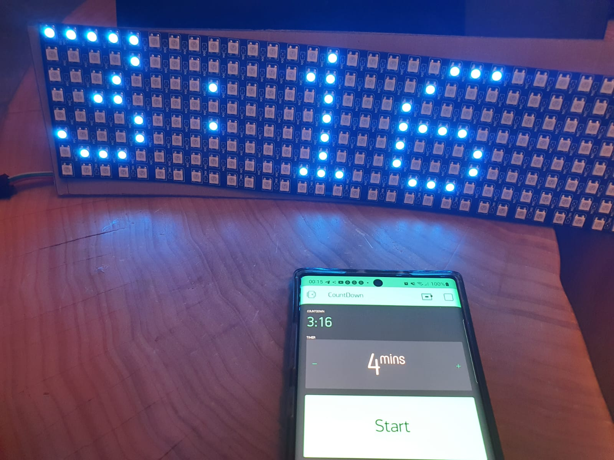
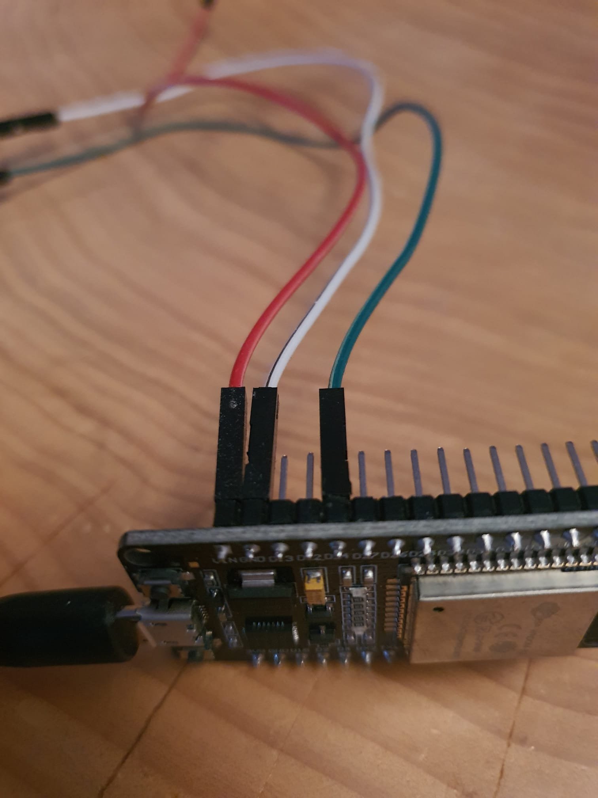
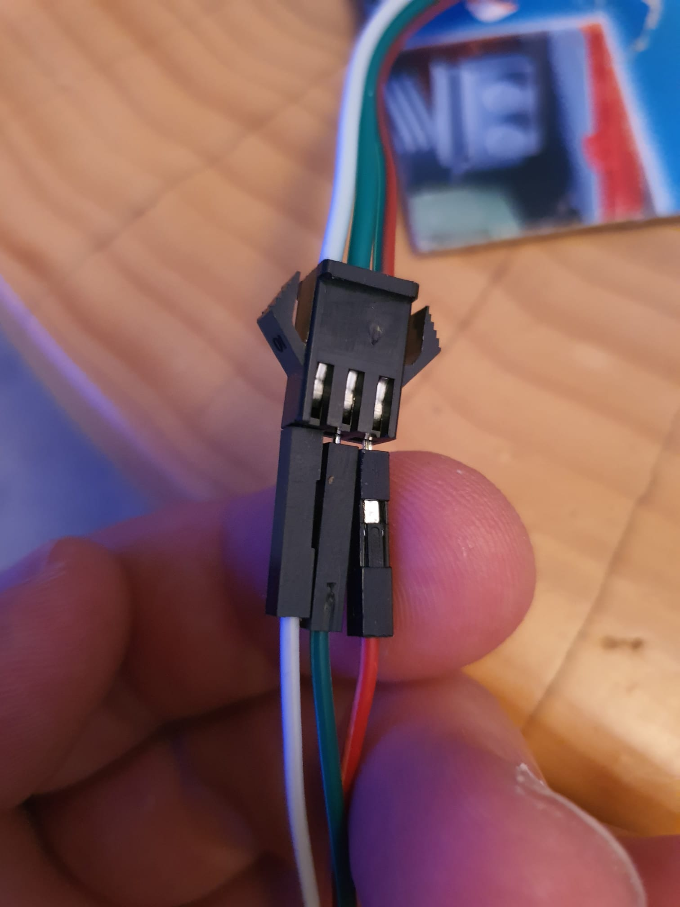
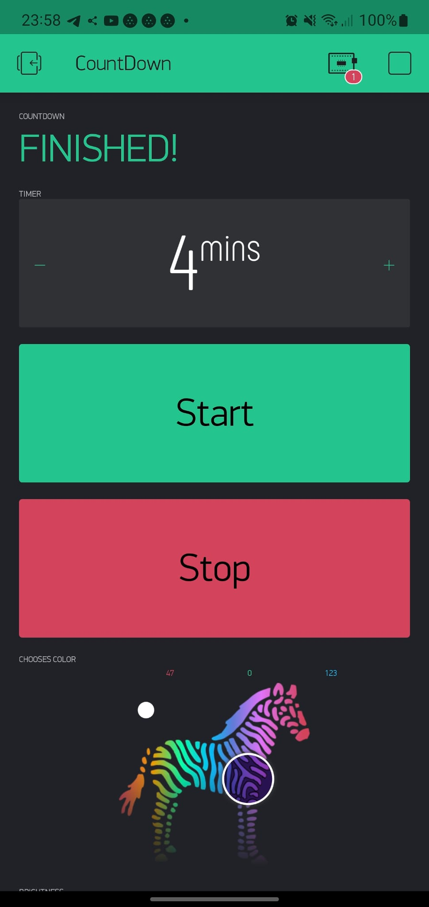

# DiaKEM injection-meal interval timer 

Simple LED-Timer application paired with Blynk IOT.

## Description




This small application is a arduino implementation of a simple timer.
It allows you to display a timer on a basic LED panel in combination with Blynk IOT. The timer can be simply setted over your Smartphone.

## Use Case

This application was created especially for my son with type-1 diabetes.
Originally we used our smartphones to set up a timer and wait for injection-meal interval.
Because this was very intransparent for him he asked several times when he can start to eat his sweets and get very restless.
I hoped that i could make him feel more comfortable by placing a timer he can access and look at. At the end we found out that this was the case.

## Setup

### Hardware

You will need the following hardware:

* Arduino compatible board like [ESP32](https://www.alibaba.com/product-detail/Wholesale-ESP32-ESP32S-ESP32-DEVKIT-V1_1600135879207.html?spm=a2700.galleryofferlist.normal_offer.d_title.75ee5a8fznPakc&s=p)
* [32x8 LED-Panel](https://www.alibaba.com/product-detail/Bendable-Pixel-Matrix-Programmable-RGB-SMD_62535391592.html?spm=a2700.galleryofferlist.normal_offer.d_image.1d4b781cYiWWla<F10>)

#### Wiring




### Software

#### Configuration 

Before you transfer the application to your board please set the following configuration parameter:

```
define BLYNK_TEMPLATE_ID           "ENTER_TEMPLATE_ID"
#define BLYNK_DEVICE_NAME           "ENTER_DEVICE_NAME"
#define BLYNK_AUTH_TOKEN            "ENTER_AUTH_TOKEN"


char ssid[] = "ENTER_WLAN_SSID";
char pass[] = "ENTER_WLAN_PASSPHRASE";


Blynk.begin(auth, ssid, pass, "ENTER_BLYNK_URL", "ENTER_BLYNK_PORT_AS_INTEGER");
```

### Blynk

The timer will be controlled over a small Blynk project:



## Contributing

Contributions are what make the open source community such an amazing place to learn, inspire, and create. 
Any contributions you make are greatly appreciated.

If you have a suggestion that would make this better, please fork the repo and create a pull request. 
You can also simply open an issue with the tag "enhancement". Don't forget to give the project a star! Thanks again!

* Fork the Project
* Create your Feature Branch (git checkout -b feature/AmazingFeature)
* Commit your Changes (git commit -m 'Add some AmazingFeature')
* Push to the Branch (git push origin feature/AmazingFeature)
* Open a Pull Request

## License

Distributed under the MIT License.

## Contact

Selcuk Kekec

E-mail: [khskekec@gmail.com](khskekec@gmail.com)
